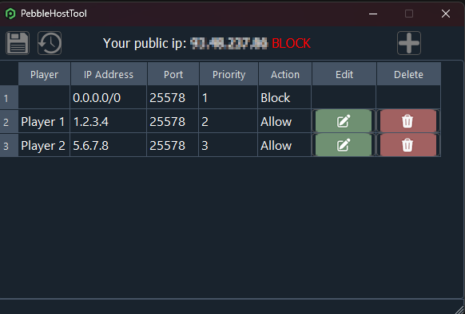
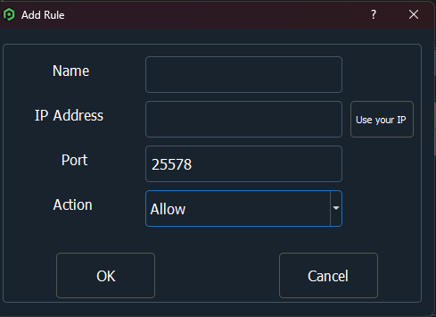

# PebblehostTool

**PebblehostTool** is a Python application that allows you to view and edit firewall rules on a Pebblehost-hosted server using their official REST APIs.

## Configuration

1. Create a file named `config.json` in the project root (if it doesn't already exist).
2. Add your API key and server ID using the following format:

```json
{
    "pebbleAPI": "your_pebbel_api",
    "server": "your_server_id"
}
```

## How It Works

When the application starts, it automatically retrieves the current firewall rules configured on your Pebblehost server, including all allowed and blocked IP addresses.

If the software has been used before, it will also attempt to load previously stored player name-to-IP associations. These names are user-defined labels that help identify which IP belongs to which player, and they are stored locally on the server alongside the firewall data.

### View and Manage Firewall Rules

The main interface displays all current firewall rules, showing which IPs are allowed or denied. Users can edit existing entries or add new ones, associating player names to IP addresses for easier identification.

### Saving Changes

Once you're done editing, clicking the **Save** button will:

- Update the firewall rules on the server via Pebblehost's API.
- Save or update the file containing player name associations.
- Automatically ensure that a **default deny-all rule (`0.0.0.0/0`)** is present with **priority 1**, to block all IPs by default.

This design ensures that only the IPs explicitly added via the tool are allowed access — making the software ideal for controlled access environments.

### Restoring the Original State

If you make a mistake or want to revert your changes, you can click the **Restore View** button to reload the current firewall state from the server without applying any unsaved modifications.





## Precompiled Executable

A precompiled .exe version for Windows 11 64-bit of the tool is available for download under the [Releases](https://github.com/MattoMatteo/PebblehostTool/releases) section.
Make sure to place your config.json file next to the executable.

For other operating systems or architectures, you must build the executable yourself (instructions below).

## How to Install and Build
Follow these steps to download the project, install dependencies, and generate the executable:

1. Clone the repository:

```bash
git clone https://github.com/MattoMatteo/PebblehostTool.git
cd PebblehostTool
```

2. Create and activate a virtual environment:

```bash
git clone https://github.com/MattoMatteo/PebblehostTool.git
source venv/bin/activate  # On Windows use: venv\Scripts\activate
```

3. Install the required dependencies:

```bash
pip install -r requirements.txt
```

4.Build the executable with PyInstaller:

```bash
pyinstaller --onefile --noconsole --icon=Data/ico/app.ico --add-data "Data/ico;Data/ico" --add-data "Data/ui_template;Data/ui_template" main.py
```
The final executable will be available in the dist/ folder. The config.json file must be placed alongside the .exe for the application to function correctly.

Make sure your config.json file is set up as described above.

## License

This project is licensed under the [MIT License](https://github.com/MattoMatteo/PebblehostTool/blob/main/LICENSE).
